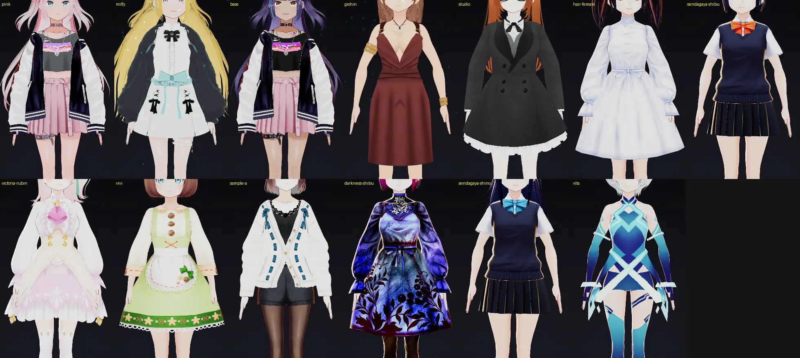
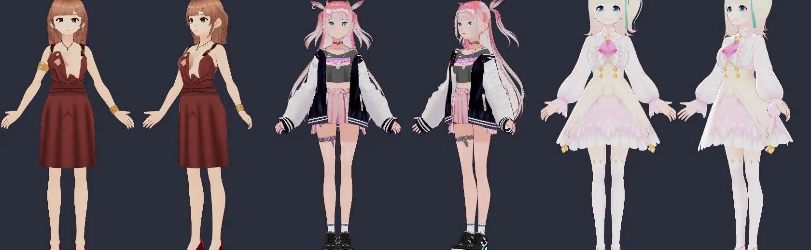
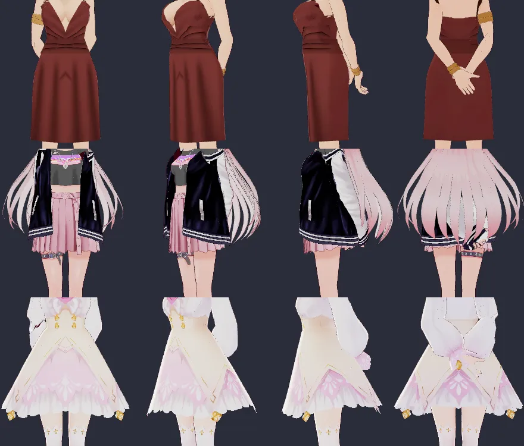

# Avatar idle poses: replace the mannequin rest with two looping idle poses

Status: implemented 2026-09-30 (see "As built" at the end). The sections up
to "Prototype results" are the plan as agreed; `scripts/prototypes/idle-poses.mjs`
is the throwaway prototype behind them.

## The problem

Every body stands in the same fixed rest pose whenever no clip plays
(`avatarMode.armRestPins`, applied by `pinArms` in `avatarGuideEngine.ts`):

- upper arm `ARM_REST_UPPER_Z = 1.15` rad (66° down from the T-pose, so the
  arms stand about 24° out from the body: an A-pose)
- forearm `ARM_REST_FORE_Z = 0.25` rad, bent in the frontal plane, not forward
- hand 0, and all 30 finger bones at identity: flat hands, straight fingers
  pointing at the floor
- one set of numbers for every family

It reads as a mannequin, worst on bare-armed looks (Gishin; also Shibu, Shino
and Vita in short sleeves). On `/avatar` it is permanent: the `stage`
placement has no motion frame, so `motionsFor('stage', …)` is empty and the
idle clip rotation never runs (`avatarMotions.motionFrame`). In the chat
widget it shows between clips.

What the shipped motion-capture clips say a relaxed human stance is (first
and last frames, `public/avatar/animations/*.vrma`): upper arm 69–77° down,
elbow 6–17°, wrist about 20° (`idleLoop`), finger proximals 20–30° (`spin`,
`squat`, `modelPose`, `peaceSign` ends).

## The owner's two reference poses

Both come from a mobile gacha game's dressing room (owner's screenshots,
2026-09-30; not committed: third-party art). Both are Live2D-style looping
idles: the pose holds while breathing, sway and small head moves keep her
alive.

1. **Open hands.** Upper arms slightly out (about 20–25°), elbows nearly
   straight, forearms flaring a little further out, wrists turned so the
   palms face forward and down, hands just outside the thighs, fingers
   relaxed, loosely spread and slightly curled.
2. **Hands behind the back.** Upper arms back, elbows close to the body,
   hands low behind the hips and clasped like a real person's: one hand holds
   the other wrist. Owner's corrections on the prototype: the hands must not
   show from the front (first try had them too high), and the two hands must
   actually cross and hold, not just meet.

## Agreed plan

**A. Stage idle: loop the two poses.** When no clip plays on `/avatar`, she
holds one of the two poses with a looping life layer (breathing, weight
shift, occasional head tilt, small finger drift) and crossfades to the other
every 15–20s (**owner chose automatic alternation**, option 1). A visitor's
motion plays over it and blends back to the current idle pose. The
motion-capture `idleLoop` stays in the motions tab.

**B. The open-hands pose becomes the rest pose everywhere**, replacing the
A-pose, so the chat widget's between-clip rest is natural too.

- Define both poses as body-relative targets (which way each segment points,
  which way the palm faces), not raw Euler angles, and solve the joint
  rotations per body and per VRM version. That is what the prototype does
  (`basisQ`), and it works unchanged on 0.x and 1.0 files.
- The clasp is solved, not authored: the outer hand's arm directions are
  searched until its palm centre sits on the other wrist (2.5cm behind it).
- Measure per family, the way `rigProbe` already measures clips: hand and
  forearm skin against torso, hips, skirt and sleeves; for the back pose also
  "no hand visible from the front". Extend `rigProbe` and add tests for both
  poses on every offered family, so a new body or a changed angle that clips
  fails a test. The engine file's own history (2026-08-19) is why: hand-
  authored arm angles put hands inside heads until they were measured.

**C. Transitions.** Crossfade between clips and idle poses and between the
two poses, fingers included (today `stopMotion` → `pinArms` snaps every finger
to identity).

## Prototype results

Open hands, first try, looks right on Gishin, Pink and Victoria (bulky
sleeves). Gishin's hands can come in a little.

Hands behind the back, second version (front, 50°, side, back per body):
hands 7–12cm below the hips bone and 11–15cm behind it, centred, hidden from
the front. Clasp solve error (outer palm to target): Gishin 0.6mm, Victoria
18mm, Pink 41mm. The last two hit the search bounds (`hd`, `hb`); give the
solver wrist twist and elbow flare as extra freedom. Pink's long hair covers
the back anyway, and every body's spring colliders include both arms and
hands (checked 2026-09-30), so hair drapes over the arms instead of through
them. The outer hand's fingers are partly hidden behind the other wrist and
its bracelet; curl them so the grip reads.

Known prototype-only artefact: Gishin's dress shows holes at the chest after
the prototype's crude 90-frame spring settle. The site's renderer does not
show this.

## Constraints

- `avatarMode.ts` and `avatarMotions.ts` are shared with vtuber-kit
  (`vtuber-kit/src/components/chat/shared-with-site.json`): sync both copies
  and run `npx tsx scripts/engine-drift.ts --update` there, then the kit tests.
- Keep every framing intact: phone HUD, desktop full body, the widget's
  waist-up and column frames. The open pose's reach must stay inside
  `stageLayout.REST_HALF_WIDTH` and the widget canvas.
- Changing the widget's rest pose affects the clearance data (`endWrist`
  waivers, motion handover); rerun `rigProbe`, `clearance` and
  `motionHandover` tests.
- Ask the owner about a changelog entry when done (CLAUDE.md).

## Verification

- All 13 looks × 2 poses rendered front, 45° and back, hands zoomed, compared
  by eye.
- Clearance numbers from `rigProbe`, held by tests.
- Phone and desktop framings on `/avatar`, and the chat widget, checked for
  cropping.

## As built (2026-09-30)

- `src/components/chat/idlePose.ts` solves both poses per body from its rest
  positions and VRM version. The engine solves them at load; `rigProbe`
  applies the same solver, so the tests measure what the engine draws.
- Both arms of the clasp are placed by two-bone IK. The held wrist sits
  behind the hips, across by hip width and 4cm behind her surface (at most
  1.5 hip widths back; see "The clasp rests on her" below); its height is
  wherever the held forearm lands from an elbow hung beside her (see "Arms at
  her sides" below), so long-armed bodies clasp lower.
  The holding hand takes the held wrist from her side of it, palm back,
  its palm 25mm in front of the wrist on every offered body.
- The arms are jointed the way arms are (`hinged` in `idlePose.ts`): the
  elbow bends only toward its crook, the upper arm's roll is whatever aims
  the crook at the forearm, and the forearm rolls for the hand so the wrist
  does not twist. Built segment by segment from guessed palm normals, the
  first version bent both elbows about 60° backwards and rolled the left
  forearm 166° ("both arms would break", owner, 2026-09-30); the unsigned
  elbow angle the tests read then counted a backwards elbow as a bent one.
  `rigProbe.probeArmJoints` now reads each joint in its parent's frame and
  the tests hold every look to human ranges: elbow 0–150° and within the
  carrying angle, forearm rotation within 90°, shoulder rotation within 90°
  (103° since "Arms at her sides" below), wrist roll within 10°.
  Measured then: elbows 61–74°, shoulder rotation 69–85°, forearm roll 80–85°,
  wrist roll at most 5.4° (the clasp has since moved; see below).
- The crossfade keeps the elbows jointed too: each forearm's bend and roll
  are blended apart (slerped whole, an elbow bent 18–19° sideways part way).
  It runs by way of a waypoint (`IDLE_POSE_VIA`): each wrist beside and
  behind her hips, the arm solved by the same IK as the clasp, so the fade
  passes through an arm a person could hold. Straight across, the
  hands cut 47mm into her hips; the first fix, a fixed 12° swing out, cleared
  her skin but still swept them through every skirt and hem. The waypoint
  stands 2.5 hip widths behind her since the elbows moved out (at 1.9 the
  last fifth of the fade brushed three looks' hems, up to 8.7mm).
- One sweep through the waypoint (2026-10-01, owner: the move behind her
  back "is right but jerky"). The fade had run as two blends, each eased at
  both ends, so her wrists stopped dead at the waypoint (3% of their top
  speed) and went back 150° from the way they came (Gishin's right wrist). `sweepPoses` runs one
  curve per bone through the three poses, eased only at the two ends; each
  axis keeps moving through the waypoint where it lies between the poses and
  turns there at rest where the waypoint is its far point. Tried first: a
  squad (20° turn in one frame at the waypoint) and a curve that kept every
  axis moving through it (bent the elbows backwards 3–8° and left the stage
  frame). Now the wrist rounds the
  waypoint at 39% of its top speed (Gishin), on a curve, and every look's
  joint, frame and clothes checks still pass through the fade.
- Clothes (added 2026-09-30, owner: "on Shibu the hands go inside her clothes
  when they come in to her body"): `rigProbe.clothShell` takes the outermost
  cloth anchored to her trunk and legs, skirt chains included, per 1cm band
  and 5° bearing round her hips, and the tests hold every hand outside it in
  both poses and through the fade.
- The clasp rests on her (same day, owner: "the arm pose behind her back is
  very unnatural"). It sat a fixed 1.2 hip widths behind her hips joint:
  pink's fingers sank 25mm into her jacket, Sendagaya Shibu's hands hung 4cm
  off her skirt, and every upper arm was thrown 49–73° back to reach. The
  solver now takes her surface (`PoseSkeleton.surface`: every vertex anchored
  to her trunk or legs, `TRUNK_ANCHOR`), the engine reading it off the loaded
  meshes and the tests off the file, and puts the held wrist 4cm behind it.
  Shown three heights, the owner chose the lowest (elbows bent 40°), with
  the collarbones swung back 40°. Measured then: hands 0.8–42.5mm off her
  clothes, upper arms 29–45° back, elbows 36–54°, shoulder rotation at most
  83.5°. milfy's hoodie stands too far out to rest on (2.05 hip widths), so
  the clasp stops at 1.5 and her hands go under its hem; studio's flared
  coat takes her open hands 20.0mm in. Both are waived (numbers below).
- Owner's notes on the way, each now a test in `idlePose.test.ts`:
  "the arms behind are too straight" (elbows were 32–49°, then 61–74°),
  then "they should sit closer to the body" (elbows bent outward stood
  5–15cm past the shoulder joints and read as hands on hips; they now point
  back, and every elbow stood 22–59mm inside its shoulder joint, measured
  before the clasp moved; the test allows 3cm past it). The clasp resting on her (above) brought the elbows
  back to 36–54°, the owner's choice once the upper arms stopped reaching.
- Clipping is measured against capsules inscribed in the torso and thigh
  skin (`rigProbe.torsoCapsules`). A first try counted ray crossings, and
  real exports are not closed meshes: it read a hand behind Gishin's dress
  as 217mm inside her. Limit 8mm; milfy is waived to 25mm (measured 15.2mm
  behind her back before the clasp moved, 0mm after, 0.9mm since the elbows
  moved out, and 10.7mm with open hands: sleeve on the hem of a bell-shaped
  hoodie, cloth on cloth).
- The open pose was narrowed from the prototype (upper arm 22°→16°,
  forearm 30°→24°, hand 58°→38° out): wrists 24–26cm from the midline
  (the test allows 20–28cm).
- The engine writes the pose every frame on the procedural share of the
  body, so clips settle back into it with the fingers; the stage clock
  alternates the poses every 15–20s and pauses under a clip; the stage now
  also plays the head and torso idle beats (it offered no clips, so the
  idle roll used to wait forever).
- vtuber-kit carries `idlePose.ts` as an eleventh shared module.
- The life layer's finger drift: each finger's base joint curls and opens
  up to 3° on its own 5–7s period; the holding hand keeps still while it
  grips.
- Arms at her sides (same day, owner on a phone, with a game's dressing room
  for reference: "from the front both arms have completely vanished"). The
  collarbones swung back 40° and the elbows bent back and in behind her, so
  0–17% of each upper arm's skin showed from the front. Now each upper arm
  hangs 40° back with its elbow 3cm outside the shoulder joint
  (`CLASP.upperBack`, `CLASP.elbowIn`), the collarbones swing back 20°, and
  only the forearms go round her; the upper arms show 33–84% as much as with
  open hands. Measured on every offered look: elbows 14–28mm past the
  shoulder joints and bent 43–71°, hands 2.7–22.7mm off her clothes (milfy
  88.0mm under her hoodie's hem, waived), shoulder rotation 89–102°. That
  last is past the 90° the tests held: with the elbows out, the forearms
  cross her back and the upper arms turn in to follow; turning them in no
  further tucks the elbows back behind her.
- Skin at the shoulders and elbows (same day, owner: "strange notch lines at
  both elbows", and a hole in Sendagaya Shibu's sleeve). VRoid arms have no
  twist bones, so a bone rolled about its own length wrings the skin blended
  across its top joint: the forearm's roll (80° and more in the poses and the
  motion-capture clips) put a crease with its outline across each elbow, and
  the upper arm's (turned in to bring the hands behind her) tore the sleeve
  open under the shoulder. `idlePose.armRollsToWrist` moves each upper arm's
  roll onto its forearm and each forearm's onto its hand for the skinning
  only, just before `vrm.update`, and puts them back after: no joint moves,
  and the wrist takes the whole roll cleanly.
- A bent elbow's notch (same evening, owner: "the notch lines at the elbows
  are still there", on Gishin's wave). This one is not the roll: bent 125°,
  the elbow shows it with or without `armRollsToWrist`, and hiding the
  outline takes it away. It is MToon's inverted hull coming through where the
  bent elbow folds her skin through itself, some centimetres from the joint
  (bounded by the tapers below, not measured).
  `elbowOutline.thinOutlinesAtElbows` tapers the outline to nothing within
  3.5cm of each elbow (bind pose) and leaves it whole from 7cm; a taper from
  1.5cm to 4cm left the notch and one from 2.5cm to 6cm left a dotted trace.
- A clip over the idle pose (same evening, owner: "the wave pose is broken").
  `waveWink` then turned only her arms and hands (it is cut from the peace
  sign's mocap since 2026-10-01), and over the hands-behind pose she waved
  with its shoulders swung back 20° and its fist, by two routes. The
  idle pose was blended from each bone's last value, which walks a bone no
  clip turns all the way to the pose at any share; and when the wave took
  over from a clip that did turn the shoulders, the mixer filled the weight
  that clip gave up with what it had remembered on starting it, the idle
  pose, and restored exactly that when it let go. Now a bone no clip turns
  eases from the rest the clips were made on (arms down, the rest at
  identity; `idlePose.writeIdlePose` through `poseUnderClips`, every frame,
  since skipping the frames where the clips hold all of her stopped the
  fade a step short of rest), and the mixer remembers that rest
  (`restUnderClip` sets the bones to rest while a clip starts and puts them
  back straight after, since the chat's idle rotation starts clips mid-frame,
  before the render), so a clip fades to rest where it once faded to the
  idle pose. Nine of the other clips turn 51–53 bones, shoulders and
  fingers included; `idleLoop` turns 22, none of them fingers, so under it
  her fingers now ease straight as they did before the idle poses (2026-09-30
  morning) instead of holding the idle pose's curl.
